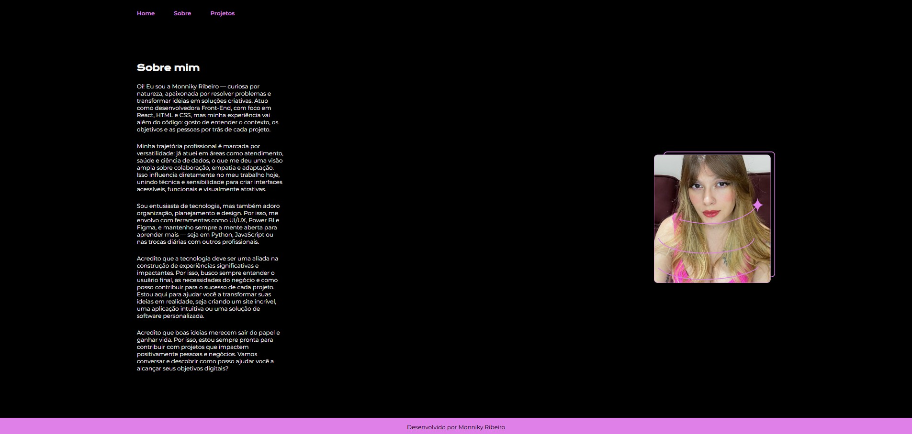

# Portfólio de Monniky Ribeiro

Este é o portfólio de **Monniky Ribeiro**, desenvolvedora Front-End especializada em **React, HTML e CSS**, com conhecimentos adicionais em **Python, JavaScript, Git, PostgreSQL, Power BI** e **Figma**.

---

## 💡 Sobre o Projeto

Este projeto é um portfólio pessoal que apresenta minhas habilidades, experiências e projetos desenvolvidos. Agora com estrutura de navegação entre páginas, o site inclui:

- **Home** (`index.html`), com layout atualizado, imagens e ícones de navegação;
- **About** (`about.html`), uma nova página com informações sobre mim;
- **Projects** (`projects.html`), página em desenvolvimento que apresentará meus principais trabalhos.

---

## 🖼️ Visualização de Tela do Portfólio - Home


## 🖼️ Visualização de Tela do Portfólio - About


## 🖼️ Visualização de Tela do Portfólio - Projects


---

## 🚀 Tecnologias Utilizadas

- **HTML**: Estrutura semântica das páginas.
- **CSS**: Estilização com Google Fonts, paleta de cores personalizada e layout responsivo.
- **Responsividade**: Design adaptável para diferentes dispositivos.
- **Organização de arquivos**:
  - `assets/`: Contém imagens, ícones e outros recursos visuais.
  - `styles/`: Arquivos CSS organizados por seções e páginas.

---

## 📁 Estrutura do Projeto

- `index.html`: Página principal (Home), com ícones e nova estrutura visual.
- `about.html`: Página com informações sobre mim.
- `projects.html`: Página em desenvolvimento para exibir meus projetos.
- `assets/`: Pasta com imagens, ícones e capturas de tela.
- `styles/`: Pasta com arquivos de estilo CSS organizados.
- `imagem.png`: Foto utilizada na apresentação.

---

## ▶️ Como Rodar o Projeto

1. Clone o repositório:
   ```bash
   git clone https://github.com/monnikys/Portifolio-FrontEnd.git


2. Abra o arquivo `index.html` em seu navegador.

### Licença
Este projeto é licenciado sob a licença MIT - veja o arquivo LICENSE para mais detalhes.

Com este `README.md`, seu repositório no GitHub estará bem documentado. Ele inclui:

- A descrição do projeto e tecnologias utilizadas.
- Como rodar o projeto.
- Informações de contato e links para redes sociais.
- A licença do projeto.

Se precisar de mais alguma coisa ou ajustes adicionais, estou à disposição!
